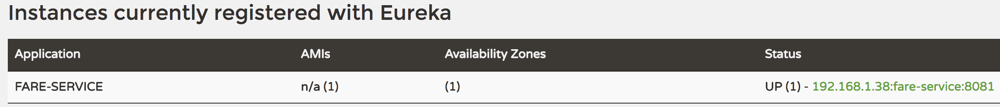
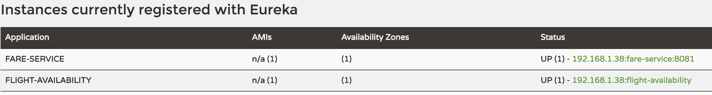

Service Registration and Discovery    
---

# Introduction

So far we have assumed that the fare-service is an external application deployed outside of our infrastructure and we configure the flight-availability (thru *PCF User Provided Service*) with the credentials to access it.

Now, we are going to assume that fare-service is an internal application deployed within the same space where flight-availability service is and we eliminate the need of securing `fare-service` with a username/password. We are going to use *Service Discover a.k.a. Eureka* to register both applications and let flight-availability discover fare-service. In other words, we dont need a *PCF User provided service* bound to the flight-availability.

We start by checking out the branch load-fares-from-internal-app-with-eureka from https://github.com/MarcialRosales/java-pcf-workshops

# Standalone setup

## Bootstrap Eureka server
1. Create eureka-server as a spring boot application (from Spring initializer) with `org.springframework.cloud:spring-cloud-starter-eureka-server` dependency and adding `@EnableEurekaServer` to the `@SpringBootApplication` main java class. Set `server.port: 8761` to the `application.yml`.
2. Launch it (`mvn spring-boot:run`) from one terminal. Go to `http://localhost:8761/` to see Eureka dashboard.

## Make fare-service register with Eureka server
1. We add the following dependency :
	```xml
	<dependency>
		<groupId>org.springframework.cloud</groupId>
		<artifactId>spring-cloud-starter-eureka</artifactId>
	</dependency>
	```
2. Add `@EnableDiscoveryClient` to the `FareServiceApplication` class
3. Add `bootstrap.yml` file with this content.
	```
	spring:
	  application:
	    name: fare-service
	```
4. Eliminate the dependency to `spring-cloud-starter-security` and also eliminate security code from `FareServiceApplication` and leave it like this:
  ```java
  @EnableDiscoveryClient
  @SpringBootApplication
  public class FareServiceApplication {


  	public static void main(String[] args) {
  		SpringApplication.run(FareServiceApplication.class, args);
  	}
  }
  ```
5. Eliminate all the security related settings and leave the `application.yml` like this:
  ```
  server.port: 8081
  ```

5. Restart the fare-service, and then confirm its appearance in the Eureka Server's Dashboard at http://localhost:8761


## Make flight-availability discover fare-service with Eureka server

1. We add the following dependency :
	```xml
	<dependency>
		<groupId>org.springframework.cloud</groupId>
		<artifactId>spring-cloud-starter-eureka</artifactId>
	</dependency>
	```
2. Eliminate the dependency to `cloud-services` project because we don't need to read credentials from a *CUPS*
3. Eliminate all the @Configuration classes from `FlightAvailabilityApplication` and add this one instead. We have dropped username/password properties and we don't need 2 @Configuration classes but just one.
  ```java
  @Configuration
  @ConfigurationProperties(prefix = "fare-service")
  class FareServiceConfig {
  	String uri;

  	public String getUri() {
  		return uri;
  	}
  	public void setUri(String uri) {
  		this.uri = uri;
  	}

  	@Bean(name = "fareService")
  	@LoadBalanced
  	public RestTemplate fareService(RestTemplateBuilder builder) {
  		return builder.rootUri(getUri()).build();
  	}
  }
  ```
4. Add `@EnableDiscoveryClient` to the `FlightAvailabilityApplication` class
5. Add `bootstrap.yml` file with this content.
	```
	spring:
	  application:
	    name: flight-availability
	```
6. We also modify the url of `fare-service` in the `application.yml` file to so that it references by name and not by its HTTP URL.
  ```
  fare-service:
    uri: http://fare-service

  ```
8. restart the flight-availability and check it registered with Eureka:

9. Test it `curl 'localhost:8080/fares?origin=MAD&destination=FRA'`


There are 2 things happening here : First is the registration with Eureka server at bootstrap using `spring.application.name`. And second is the discovery of `fare-service` by the `RestTemplate` thanks to the annotation `@LoadBalanced`.

The `RestTemplate` bean will be intercepted and auto-configured by Spring Cloud to use a custom HttpRequestClient that uses Netflix Ribbon to do the application lookup. Ribbon is also a load-balancer so if you have multiple instances of a service available, it picks one for you.
The loadBalancer takes the logical service-name (as registered with the discovery-server) and converts it to the actual hostname of the chosen application.

If we look at the flight-availability logs, we can find this statement that probe that it resolved the `http://fare-service` url to `http://192.168.1.38:8081`.
```
2017-05-12 19:27:30.107  INFO 34069 --- [nio-8080-exec-1] c.n.l.DynamicServerListLoadBalancer      : DynamicServerListLoadBalancer for client fare-service initialized: DynamicServerListLoadBalancer:{NFLoadBalancer:name=fare-service,current list of Servers=[192.168.1.38:8081], ....
```


Another one way is to do it programmatically via the `DiscoveryClient` interface. We have provided a sample `RestController` to illustrate how it works.

```java
@RestController
class ServiceInstanceRestController {

    @Autowired
    private DiscoveryClient discoveryClient;

    @RequestMapping("/service-instances/{applicationName}")
    public List<ServiceInstance> serviceInstancesByApplicationName(
            @PathVariable String applicationName) {
        return this.discoveryClient.getInstances(applicationName);
    }

}
```

Restart the flight-availability application and execute this command:  `curl localhost:8080/service-instances/fare-service | jq .` produces:
```json
[
  {
    "host": "192.168.1.38",
    "port": 8081,
    "uri": "http://192.168.1.38:8081",
    "serviceId": "FARE-SERVICE",
		....

  }
]
```


Open a terminal and launch another instance of fare-service.
- `cd fare-service`
- `mvm spring-boot:run -Dserver.port:8082`
- `curl localhost:8080/service-instances/fare-service | jq .`
- See the `instanceId` attribute of each instance in the json outcome from the previous command. See that both instances have a value built using the ip, port and service name. We can configure each instance with a unique identifier instead. Say we add the following to `bootstrap.yml` file. This configuration means that if the application has no  `spring.application.instance_id` attribute, we use a random value. This allows us to externally set the instance ids similar to what will happen when we deploy this app in PCF:
	```
	eureka:
	  instance:
	    metadataMap:
	      instanceId: ${spring.application.name}:${spring.application.instance_id:${random.value}}
	```

# Service Discovery in the Cloud

	Note: Each attendee has its own account set up on this PCF foundation: https://apps.run-02.haas-40.pez.pivotal.io

## Create Eureka or Service Registry in PCF

1. login
  `cf login -a <CF URL> --skip-ssl-validation`

2. create service (http://docs.pivotal.io/spring-cloud-services/service-registry/creating-an-instance.html)

  `cf marketplace -s p-service-registry`

  `cf create-service p-service-registry standard registry-service`

  `cf services`

  Make sure the service is ready. PCF provisions the services asynchronously.

3. Go to the AppsManager and check the service. Check out the dashboard.

## Deploy fare-service in PCF

1. Add `registry-service` to the list of services required by `fare-service` in the application's manifest :
  ```
  ---
  applications:
  - name: fare-service
    memory: 1G
    instances: 1
    host: fare-service
    path: target/fare-service-0.0.1-SNAPSHOT.jar
    services:
    - registry-service
  ```

> To avoid DNS clashing we have randomized the hostname: i..e hostname: fare-service-${random-word}

2. push the application (check out url, domain)  
  `cf push`

3. Check the credentials PCF has injected into our application

  `cf env <YOUR_APP_NAME>`

  You will get something like this because we have stated in the `manifest.yml` that our application needs a service called `registry-service`. PCF takes care of injecting the credentials from the `registry-service` into the application's environment.

  ```
  {
   "VCAP_SERVICES": {
    "p-service-registry": [
     {
      "credentials": {
       "access_token_uri": "https://p-spring-cloud-services.uaa.system-dev.chdc20-cf.pez.com/oauth/token",
       "client_id": "p-service-registry-XXXXXXXX",
       "client_secret": "XXXXXXX",
       "uri": "https://eureka-044ac701-7919-4373-ad76-bdd0743fd813.apps-dev.chdc20-cf.pez.com"
      },
      "label": "p-service-registry",
      "name": "registry-service",
      "plan": "standard",
      "provider": null,
      "syslog_drain_url": null,
      "tags": [
       "eureka",
       "discovery",
       "registry",
       "spring-cloud"
      ],
      "volume_mounts": []
     }
    ]
   }
  }
  ```
  Thanks to a Spring project called [Spring Cloud Connectors ](http://cloud.spring.io/spring-cloud-connectors/) and [Spring Cloud Connectors for Cloud Foundry](http://cloud.spring.io/spring-cloud-connectors/spring-cloud-cloud-foundry-connector.html), Spring Cloud Eureka is configured from the VCAP_SERVICES. If you want to know how you can start looking at [here](https://github.com/pivotal-cf/spring-cloud-services-connector/blob/master/spring-cloud-services-cloudfoundry-connector/src/main/java/io/pivotal/spring/cloud/cloudfoundry/EurekaServiceInfoCreator.java)

4. Go to the Dashboard  of the registry-service and check that our service is there
5. Scale the app to 2 instances. Check the dashboard.

## Deploy flight-availability in PCF

	1. add `service-registry` service to the  application's manifest and remove the previous *CUPS* service that pointed to the `fare-service`
	2. push the application
	3. Check the app is working  
    `curl '<YOUR_APP_URL>/fares?origin=MAD&destination=FRA'`
    `curl <YOUR_APP_URL>/service-instances/fare-service | jq .`

# Zero-downtime deployment

We are going to push a new version of the fare-service following a blue/green deployment. In other words, we are going to push the `fare-service` as a new application name and host, i.e. a new app as far as PCF is concerned.

1. modify manifest.yml:
  ```
  ---
  applications:
  - name: fare-service-0.0.1
    memory: 1G
    instances: 1
    host: fare-service-0.0.1
    path: target/fare-service-0.0.1-SNAPSHOT.jar
    services:
    - registry-service
  ```
2. `cf push`
3. `cf apps` should reveal we have these 2 applications deployed: `fare-service` and `fare-service-0.0.1`. The former is listening on its url and `fare-service-0.0.1` is listening on `fare-service-0.0.1`.
4. Go to Eureka dashboard and check out the urls `fare-service` registered with. There should be 2 urls.
5. Send requests to flight-availability. 50% of the requests will go to `fare-service` app and the other 50% go to `fare-service-0.0.1` application. Check in the logs `fare-service-0.0.1` is getting requests.
6. Stop or delete `fare-service`
7. Keep sending requests to flight-availability. This time all requests are all served by `fare-service-0.0.1`.

> Given that spring cloud applications automatically register with eureka during its bootstrap this means that the new version is available to other applications before we had the chance to test it.
