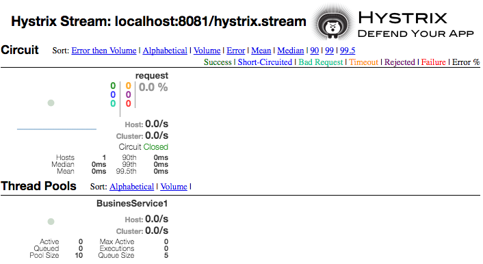
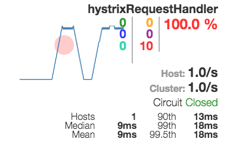
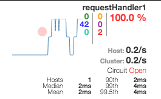
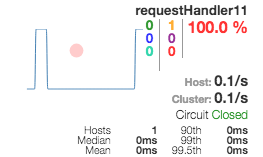
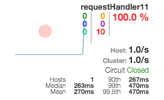

Make applications resilient with Hystrix
---

# Make applications resilient

In a distributed environment, failure of any given service is inevitable. It is impossible to prevent failures so it is better to embrace failure and assume failure will happen. The applications we have seen in the previous labs interacts with other services via a set of adaptors/libraries such as *Spring RestTemplate*. We need to be able to control the interaction with those libraries to provide greater tolerance of latency and failure. *Hystrix* does this by isolating points of access between the application and the services, stopping cascading failures across them, and providing fallback options, all of which improve the system's overall resiliency.

Principles of resiliency: (influenced by [Release It! Design and Deploy Production-Ready Software](http://pragprog.com/book/mnee/release-it))
- A failure in a service dependency should not break the upstream services
- The API should automatically take corrective action when one of its service dependencies fails
- The API should be able to show us what’s happening right now

A Hystrix's circuit breaker opens when:
- A request to the remote service times out. *Protects our service should the downstream service be down*
- The thread pool and bounded task queue used to interact with a service dependency are at 100% capacity. *Protects our service from overloading the downstream service and/or our service itself*
- The client library used to interact with a service dependency throws an exception. *Protects our service in case of a faulty downstream service*

It is important to understand that the circuit breaker does only open when the error rate exceeds certain threshold and not when the first failure occurs. The whole idea of the circuit breaker is to immediately fallback using of these 3 approaches:
- **custom fallback** - which returns a stubbed response read from a cache, etc.
- **fail silent** - which returns an empty response provided the caller expects an empty response
- **fail fast** - return back a failure when it makes no sense to return a fallback response. `503 Service not available` could be a sensible error that communicates the caller that it was not possible to attend the request

The 3rd principle is to have some visibility on the circuit breaker state to help us troubleshoot issues. The circuit breaker tracks requests and errors over a 10 second (default) rolling window. Requests and/or errors older than 10 seconds are discarded; only the results of requests over the last 10 seconds matter.

Here is an excerpt that shows what a Hystrix Dashboard looks like. It shows one circuit for one application:
- The grey 0% in the upper right shows the overall error rate for the circuit. It returns red when the rate is greater than 0 %.
- The green “Closed” word show that the circuit it healthy. If it is not healthy it shows "Open" in red.
- The green count (200,545) is the number of successfully handled requesta
- The blue count (0) is the number of short-circuited requests, i.e. Hystrix returned a custom/empty fallback or failed fast.
- The orange count (19) is the number of timed out requests
- The purple count (94) is the number of rejected requests because the exceeded the maximum concurrency level
- The red count (0) is the number of failed requests to the downstream service
- Each circuit has a circle to the left that encodes call volume (size of the circle - bigger means more traffic) and health (color of the circle - green is healthy and red indicates a service that’s having problems)
- The sparkline indicates call volume over a 2 minute rolling window
- The stats below the Circuit state corresponds to the average, median and percentiles response times.


## Labs

We are not going to use the applications from the previous labs instead we are going to work on 2 brand new applications, *client* and *service-a*, because they will allow us to simulate failures in the downstream service, *service-a*. These applications are in the `add-resiliency` branch. Check it out `git checkout add-resiliency`.

First we are going to start with a non-resilient version of these two applications. Then we test the lack of resiliency using 3 scenarios and assess the performance and availability impact on the *client* application. Once we understand the implications of a non-resilient application, we make the corresponding code changes to make it resilient. Before we test the resiliency, we explore various ways exist to monitor whats happening (remember this is the 3rd principle of resiliency). Finally, we proceed to test various failure scenarios and identify the problems thru the Hystrix dashboard.

- [Start with non-resilient client-server](#introduction)
- [Test lack of resiliency](#Test-lack-of-resiliency)
	- [*service-a* goes down]()
	- [*service-a* is unexpectedly too slow to respond]()
	- [*service-a* is constantly failing]()
- [Make application resilient](#Make-application-resilient)
	- [Monitor the circuits using Actuator]()
	- [Monitor the circuits using Hystrix dashboard]()
	- [*service-a* goes down]()
	- [*service-a* becomes very slow to respond]()
	- [*service-a* is constantly failing]()
	- [Prevent overloading *service-a*]()
- [How to configure Hystrix](#How-to-configure-Hystrix)


# Introduction

We are using the following client-server set up:
```
  client -http---> service-a
```

*service-a* is a REST backend which listens on the root path and replies back the message we pass in the request parameter `message`. It accepts 2 http headers: `delay` which controls the time it takes the service to respond. And `response` which controls the HTTP Status the service responds with.

*client* is a Rest application which listens on the path `/req0` and calls the `service-a`. It passes the incoming http request's headers to downstream http request to the `service-a` so that we can control how long will take `service-a` to respond and/or which HTTP status code shall return.

This is the *client* RestController:
```java
@RestController
class Client {

	@Autowired
	@Qualifier("serviceA")
	BusinessService plainService;


	@GetMapping("/req0")
	public String request0(@RequestParam String message, RequestEntity<?> req) {		
		return this.plainService.request(buildRequest(req, message));
	}

  private RequestEntity<?> buildRequest(RequestEntity<?> originator, String message) {
		URI uri = UriComponentsBuilder.fromHttpUrl("http://localhost:8080").queryParam("message", message).build()
				.toUri();
		HeadersBuilder<?> rb = RequestEntity.get(uri);
		originator.getHeaders().forEach((String h, java.util.List<String> v) -> rb.header(h, v.toArray(new String[v.size()])));
		return rb.build();
	}
}
```

*client* calls the downstream service, `service-a`, via the class `BusinessServiceImpl` which uses *RestTemplate* to make http requests.

```java
@Service("serviceA")
class BusinessServiceImpl implements BusinessService {
	@Autowired
	RestTemplate template;

	public String request(RequestEntity<?> req) {
		ResponseEntity<String> response = this.template.exchange(req, String.class);
		return response.getBody();

	}

	public String request2(RequestEntity<?> req) {
		return request(req);
	}

}
```

## Test client-server connectivity

1. start *service-a*
  `service-a/mvn spring-boot:run`
2. start *client*
  `client/mvn spring-boot:run`
3. test connectivity
  `curl localhost:8081/req0?message=hello`
4. test connectivity using Apache Benchmark
  `./test-ab.sh 100 4 200 250 localhost:8081/req0?message=hello`

  `100` is the total number of requests  
  `4` is the number of concurrent requests  
  `200` is the http response `service-a` should send back  
  `250` is the number of milliseconds that `service-a` will wait before responding

  It produces these percentiles:
  ```
  Percentage of the requests served within a certain time (ms)
  50%    262
  66%    263
  75%    264
  80%    264
  90%    266
  95%    267
  98%    273
  99%    287
  100%    287 (longest request)
  ```

  The longest request took approximately the delay we induced to the *service-a*, i.e. 250 msec.

# Test lack of resiliency

Our *client* application is not very resilient at the moment. Let's explore various scenarios to probe it. And later on we will see how we can make our application more resilient with Hystrix.

## *service-a* goes down

1. stop *service-a*
2. test connectivity using Apache Benchmark
  `./test-ab.sh 100 4 200 250 localhost:8081/req0?message=hello`

  It produces these percentiles:
  ```
  Percentage of the requests served within a certain time (ms)
  50%     18
  66%     25
  75%     37
  80%    603
  90%    657
  95%    686
  98%    692
  99%    697
  100%    697 (longest request)
  ```

Requests are now taking substantially longer which means less threads to handle other requests on the *client*. In a nutshell, *service-a* may also bring down and/or seriously reduce the availability and responsiveness of *client*.

## *service-a* is unexpectedly too slow to respond


1. start *service-a*
  `service-a/mvn spring-boot:run`
2. test connectivity using Apache Benchmark. This time *service-a* is going to take 1 sec to respond rather than 250msec.
  `./test-ab.sh 100 4 200 1000 localhost:8081/req0?message=hello`

  It produces these percentiles:
  ```
  Percentage of the requests served within a certain time (ms)
  50%   1013
  66%   1015
  75%   1015
  80%   1016
  90%   1018
  95%   1023
  98%   1248
  99%   1259
  100%   1259 (longest request)
  ```

Requests take far longer than when the service was down causing bigger problems to *client*.

## *service-a* is constantly failing

1. start *service-a*
  `service-a/mvn spring-boot:run`
2. test connectivity using Apache Benchmark. This time *service-a* is going to reply with a *500 Internal Error*
  `./test-ab.sh 100 4 500 250 localhost:8081/req0?message=hello`

  It produces these percentiles:
  ```
  Non-2xx responses:      100

  Percentage of the requests served within a certain time (ms)
  50%    266
  66%    268
  75%    270
  80%    272
  90%    277
  95%    287
  98%    313
  99%    316
  100%    316 (longest request)
  ```

We have configured the test to reply in 250 msec but it can also happen that *service-a* takes longer to process the request which eventualy fail with a *500 Internal Error*. The point here is that *client* keeps sending requests to *service-a* regardless of the failure rate.

# Make application resilient

We are going to use Hystrix to make our *client* application more resilient.

First we add the Hystrix library to our project. Add this dependency to your `pom.xml`:
```xml
  <dependencies>
  ...
  <dependency>
			<groupId>org.springframework.cloud</groupId>
			<artifactId>spring-cloud-starter-hystrix</artifactId>
	</dependency>
  ...
  </dependencies>
```
There are various ways of specifying the artifact version, but one way is by adding these tags to the `pom.xml`:
```xml
  <dependencyManagement>
		<dependencies>
			<dependency>
				<groupId>org.springframework.cloud</groupId>
				<artifactId>spring-cloud-dependencies</artifactId>
				 <version>Dalston.RELEASE</version>
				<type>pom</type>
				<scope>import</scope>
			</dependency>
		</dependencies>
	</dependencyManagement>

```  

Let's modify the source code. We create a new implementation of *BusinessService* by extending `BusinessServiceImpl` and making it a service with a distinct name (`@Service("hystrixServiceAWithThread")`).
  ```java
  @Service("hystrixServiceAWithThread")
  class BusinessService1 extends BusinessServiceImpl{
  ```

We override each remote method (i.e. `request` and `request2`) and annotate it with `@HystrixCommand()`.

```java
@Service("hystrixServiceAWithThread")
class BusinessService1 extends BusinessServiceImpl{

	@HystrixCommand()
	public String request(RequestEntity<?> req) {
		return super.request(req);
	}

	@HystrixCommand()
	public String request2( RequestEntity<?> req) {
		return super.request2(req);
	}


}
```

If this were a production code we would modify the existing code so that it called the new service as shown here:
```java
  @Autowired
  @Qualifier("hystrixServiceAWithThread")
  BusinessService hystrixService1;

  @GetMapping("/req0")
  public String request0(@RequestParam String message, RequestEntity<?> req) {		
    return this.hystrixService1.request(buildRequest(req, message));
  }
```

However, we want to keep `/req0` endpoint as it is and add a new one `/req1` which uses the hystrix service instead.

```java
@RestController
class Client {

  ...

  @Autowired
	@Qualifier("hystrixServiceAWithThread")
	BusinessService hystrixService1;


	@GetMapping("/req1")
	public String request1(@RequestParam String message, RequestEntity<?> req) {
		return this.hystrixService1.request(buildRequest(req, message));		
	}

```

Test the new endpoint  `./test-ab.sh 100 4 200 250 localhost:8081/req1?message=hello`.


## Monitor the circuits using Actuator

We can check the status of the circuits thru the actuator `/health` endpoint.

This would be the outcome of a healthy *client* application with all its circuits closed.
```json
{
  "status": "UP",
  "diskSpace": {
    "status": "UP",
    "total": 498876809216,
    "free": 303200821248,
    "threshold": 10485760
  },
  "refreshScope": {
    "status": "UP"
  },
  "hystrix": {
    "status": "UP"
  }
}
```

This would be the outcome if the circuit `BusinesService1::request` is opened. By default, Hystrix names the circuits as follows: `<GroupKey>::<CommandKey>` where `<GroupKey>`  is the name of the class, e.g. `BusinessService1` and <CommandKey> is the name of the method, e.g. `request`. We will see in the next sections how we can override these names.

```json
{
  "status": "UP",
  "diskSpace": {
    "status": "UP",
    "total": 498876809216,
    "free": 303195176960,
    "threshold": 10485760
  },
  "refreshScope": {
    "status": "UP"
  },
  "hystrix": {
    "status": "CIRCUIT_OPEN",
    "openCircuitBreakers": [
      "BusinesService1::request"
    ]
  }
}
```

We can also capture circuit's metrics via the `/metrics` endpoint.


## Monitor the circuits using Hystrix dashboard

We can also monitor live circuit's metrics via the `/hystrix.stream` endpoint. Unless we create an application that consumes from this stream, it is going to be difficult to take advantage of it.
Instead we are going to create an Spring Boot application annotated with `@EnableHystrixDashboard` which allows us consume from `/hystrix.stream` and produce a web dashboard. Thru this dashboard we can quickly figure out which circuit is getting most requests or which ones are closed or opened, etc.

1. Launch Hystrix dashboard
  `hystrix-dashboard/mvn spring-boot:run`
2. Open a browser and point it to `http://localhost:9999/hystrix`
3. Enter the following url in the input box: `http://localhost:8081/hystrix.stream`. This is the feed of live hystrix metrics emitted by our *client* application.
4. We will see something like this :

  

  - On this web page we are looking at all the circuits for the application *http://localhost:8081/hystrix.stream* (top bar) we entered at the beginning. Because we only have one @HystrixCommand we only have one circuit.
  - The Dashboard consists of 2 sections: list of circuits and list of Thread Pools
  - There is one *circuit* per @HystrixCommand and by default there is one *Thread Pool* per Java Class which has one or many @HystrixCommand
  - We will only see a *circuit* if it has been used or called. And most likely you will have to refresh your browser to pick up new circuits.
  - Which Thread Pool is used by which circuit is not evident in the dashboard. However, if we follow certain naming convention for circuits we can infer it from their names. We will see an example later on.
  - We can sort the circuits by their volume, by the number of errors, by the mean response time, etc. This is extremely useful when we have a large number of circuits. Say our application is failed, we probably want to sort the circuits by error count to quickly identify if any of the circuits is having any issues.

We are going to explore each aspect of this dashboard in the next sections.

## *service-a* goes down

1. stop *service-a*
2. the circuit should still be closed because we have not called *service-a* yet !!!
3. test connectivity
  - send 10 requests: `./test-ab.sh 10 1 200 250 localhost:8081/req1?message=hello`
  - check the response time's percentiles. We can see that we are still trying to call *service-a*
  - check the dashboard :  
    
  - See that the circuit is still closed: Circuit: <span style="color:green">Closed</span>
  - See the count of failed requests in red font equal to <span style="color:red">10</span>. This means that the method was invoked and threw an exception.  
4. is not Hystrix working? is it not short-circuiting requests?
  - To open the circuit, we need at least 20 failed request in 10 seconds however we have placed only 10
  - This is configured thru this setting [circuitBreaker.requestVolumeThreshold](https://github.com/Netflix/Hystrix/wiki/Configuration#circuitbreakerrequestvolumethreshold)
5. test connectivity again
  - test 30 requests `./test-ab.sh 30 1 200 250 localhost:8081/req1?message=hello`
  - check the response time's percentiles. The *client* application *responds far quicker now that the circuit is opened*
  - check the dashboard:  
    
  - check the circuit is opened now <span style="color:red">Closed</span>
  - check the number of short-circuited requests <span style="color:red">42</span>

*Note*: Hystrix dashboard maintains rolling statistics. This means that the counters we see in different colors and request rates are relative to the last N seconds. If we don't send more requests, the counters reset to zero. However, the status of the circuit remains with the same status. There are 2 settings that configure the duration of the statistical rolling window:

  - [metrics.rollingStats.timeInMilliseconds](https://github.com/Netflix/Hystrix/wiki/Configuration#metricsrollingstatstimeinmilliseconds)
  This property sets the duration of the statistical rolling window, in milliseconds. This is how long Hystrix keeps metrics for the circuit breaker to use and for publishing. Default value is 10 seconds (10000).

  - [metrics.rollingPercentile.timeInMilliseconds](https://github.com/Netflix/Hystrix/wiki/Configuration#metricsrollingpercentiletimeinmilliseconds)
  This property sets the duration of the rolling window in which execution times are kept to allow for percentile calculations, in milliseconds.
  Default value is 1 minute (60000).


So far we have seen 3 Hystrix settings:  

| Setting | default value |
| --- | --- |
|  [circuitBreaker.requestVolumeThreshold](https://github.com/Netflix/Hystrix/wiki/Configuration#circuitbreakerrequestvolumethreshold) | 20 |
|  [metrics.rollingStats.timeInMilliseconds](https://github.com/Netflix/Hystrix/wiki/Configuration#metricsrollingstatstimeinmilliseconds) | 10000 |
|  [metrics.rollingPercentile.timeInMilliseconds](https://github.com/Netflix/Hystrix/wiki/Configuration#metricsrollingpercentiletimeinmilliseconds) | 60000 |

TODO Show how to adjust these settings: @HystrixCommand, @DefaultProperties, application.yml

### Why do requests are handled far quicker now?

When the circuit is opened, the method `BusinessService1.request` is not invoked, instead it throws `HystrixRuntimeException`. This exception bubbles up to the Servlet's container exception handler which replies with a `500 Internal Server error` and prints out the stack trace. We don't want to respond with a `500` instead we prefer to respond with a '503 Service not available' and furthermore, we don't want to print out the stacktrace because that consumes significant amount of cpu cycles. Therefore, we are going to add the following @ExceptionHandler:
  ```java
  @ExceptionHandler({ HystrixRuntimeException.class })
  void handleBadRequests(HttpServletResponse response, HystrixRuntimeException e) throws IOException {
    System.err.println(e.getMessage());
    response.sendError(HttpStatus.SERVICE_UNAVAILABLE.value(), "forced by caller");

  }
  ```

### When will the circuit be opened again?

In a nutshell, Hystrix regularly checks if the downstream service has come back and when it has, it closes the circuit again. The precise way that the circuit opening and closing occurs is as follows:

1. Assuming that the error percentage exceeds the threshold error percentage (HystrixCommandProperties.circuitBreakerErrorThresholdPercentage())...
2. Then the circuit-breaker transitions from *CLOSED* to *OPEN*.
3. While it is open, it short-circuits all requests made against that circuit-breaker.
4. After some amount of time (`HystrixCommandProperties.circuitBreakerSleepWindowInMilliseconds()`), the next single request is let through (this is the *HALF-OPEN* state). If the request fails, the circuit-breaker returns to the *OPEN* state for the duration of the sleep window. If the request succeeds, the circuit-breaker transitions to *CLOSED* .


To probe it, send the following command which sends a single request `./test-ab.sh 1 1 200 1000 localhost:8081/req1?message=hello`. It fails because it

### What if we want to provide a default response rather than an error?

Sometimes we can provider a default response when we are not able to contact *service-a*. This is called Graceful degradation can be achieved by declaring name of fallback method in @HystrixCommand like below. The `fallbackMethod` must be a method with the exact same signature of the method we are annotating except for the name. Each `HystrixCommand` is a *circuit breaker* which decides when it shall invoke the method or the fallback method, in order words, it decides when the circuit it closed or opened respectively.

Let's add another http request to test this behaviour:
```java
@RestController
class Client {

  ...
  @GetMapping("/req2")
  public String request2(@RequestParam String message, RequestEntity<?> req) {
    return this.hystrixService1.request2(buildRequest(req, message));
  }
  ....
```

And implement the business service method:
```java
class BusinessService1 extends BusinessServiceImpl {

  @HystrixCommand()
	public String request(RequestEntity<?> req) {
		return super.request(req);
	}


  @HystrixCommand(fallbackMethod = "returnEmptyRequest")
  public String request2(RequestEntity<?> req) {
    return super.request2(req);
  }

  private String returnEmptyRequest(RequestEntity<?> req) {
    return "";
  }
```

The fallback method signature can be extended with an additional parameter in order to get an exception thrown by the Hystrix command.
```java

  private String returnEmptyRequest(RequestEntity<?> req, Throwable t) {
    return "";
  }

```

1. test 30 requests against `/req2`: `./test-ab.sh 30 1 200 250 localhost:8081/req2?message=hello`
  - check in the dashboard that the circuit is still <span style="color:red">Opened</span>
  - check the number of `Non-2xx responses` is 0.
  - check also the number of short-circuited request in blue font.


## *service-a* becomes very slow to respond

We have tested so far the *client* application can handle the event of loosing one of its downstream services. Now we are going to test if it can handle  unexpectedly slow downstream services. It is up to us what slow means. A slow downstream service is as dangerous as not having one running. Hystrix will timeout every command that takes longer than [execution.isolation.thread.timeoutInMilliseconds](https://github.com/Netflix/Hystrix/wiki/Configuration#executionisolationthreadtimeoutinmilliseconds) which by default is 1 sec.


1. make sure *service-a* is running
2. make sure the circuit is closed by sending this request: `./test-ab.sh 1 1 200 250 localhost:8081/req1?message=hello`
3. test a slow responding *service-a: `./test-ab.sh 1 1 200 1000 localhost:8081/req1?message=hello`
4. check dashboard  
    

  - check the number of timed out requests in orange color: <span style="color:orange">1</span>
  - check the circuit it still closed. This is because we have not exceeded the error rate of 20 requests in 10 msec.

### Bulkheads and thread isolation

How could Hystrix time out or terminate the call to a service if it takes longer than 1 second? It is possible because Hystrix runs the actual method implementation of our service (i.e, `BusinessService1.request()`) in a separate thread. It does not use the caller thread. The caller thread blocks until the service's method return, either by returning a value or throwing an exception, or after 1 second or the configured time in [execution.isolation.thread.timeoutInMilliseconds](https://github.com/Netflix/Hystrix/wiki/Configuration#executionisolationthreadtimeoutinmilliseconds).

By default, all the circuits we create in `BusinessService1` share the same Thread Pool. When we call the method `request()` (represented by the blue lines in the diagram below), Hystrix places a command into a worker's queue. A thread (e.g.`Dependency A Thread` in the diagram below) executes the `request()` method which synchronously call the library we use to talk to *service-a*, i.e *RestTemplate*.

 [Click for larger view](https://github.com/Netflix/Hystrix/wiki/images/isolation-options-1280.png)


We can configure the size of the pool and several other parameters relative to the [Thread Pool](https://github.com/Netflix/Hystrix/wiki/Configuration#ThreadPool).


## *service-a* is constantly failing

How do we prevent *client* application from falling over should *service-a* had an issue which fails every request? Hystrix will interpret a connection failure or any non-2xx response as a failed request.

1. make sure *service-a* is running
2. make sure the circuit is closed
  `./test-ab.sh 1 1 200 250 localhost:8081/req1?message=hello`
3. test a request that simulates a failed response by *service-a*: `./test-ab.sh 10 1 500 250 localhost:8081/req1?message=hello`
4. check the count of Failures in the dashboard  
    
5. if we send +20 failed requests in 10 seconds, the circuit will be opened.

### Business vs non-Business failures

Certainly, *service-a* can fail back requests due to business reasons, e.g. invalid arguments, or other business rules. We dont want to open a circuit in case of business failures. We can configure Hystrix to ignore certain failures. We can do it per command or per class. We don't want to repeat ourselves so we recommend do it at the class by annotating the class with @DefaultProperties.

@DefaultProperties is class (type) level annotation that allows to default commands properties such as groupKey, threadPoolKey, commandProperties, threadPoolProperties, ignoreExceptions and raiseHystrixExceptions. Properties specified using this annotation will be used by default for each hystrix command defined within annotated class unless a command specifies those properties explicitly using corresponding @HystrixCommand parameters. Example:

```java
@DefaultProperties(groupKey = "BusinesService1", ignoreExceptions = { BusinessException.class })
class BusinessService1 extends BusinessServiceImpl {
```

And we need to modify `BusinessServiceImpl.request` method so that it throws `BusinessException` when it receives a `4xx` status.
```java
  public String request(RequestEntity<?> req) {
		try {
			ResponseEntity<String> response = this.template.exchange(req, String.class);
			if (response.getStatusCode().is4xxClientError()) {
				throw new BusinessException(response.getStatusCode().getReasonPhrase());
			}
			return response.getBody();
		} catch (HttpClientErrorException e) {
			if (HttpStatus.valueOf(e.getRawStatusCode()).is4xxClientError()) {
				throw new BusinessException(e.getMessage());
			} else {
				throw e;
			}
		}

	}
```

Requests failed due to business reasons are accounted as <span style="color:#00CC99">Bad requests</span> rather than <span style="color:red">Failures</span> or <span style="color:blue">short circuited</span> or <span style="color:orange">timed out</span>  


## Prevent overloading *service-a*

what should your application do, when the external service is unavailable?
1.	Provide timely responses to the users.

2.	Give a detailed error message to the users.

3.	Provide fall backs when the other service is down.

4.	Hooks for IT operations for monitoring to pin-point the problematic service.

5.	=> *Prevent overloading of the problematic service to avoid domino effects.
*

To deliver the above, Hystrix has built in the following defaults:
1.	Timeout for every request to an external system (default: 1000 ms)

2.	=> *Limit of concurrent requests for external system (default: 10)
*
3.	Circuit breaker to avoid further requests (default: when more than 50% of all requests fail)



Hystrix employs 2 techniques to limit the concurrency level:
- the one we have known so far based on threads where the circuit breaker command is invoked in a separate thread and that threads comes from
a dedicated Thread Pool (bulkhead). The concurrency level is limited to the pool size. This technique is resource intensive because it requires N threads.
- the other technique is based on semaphores where the circuit breaker command is invoked in the callers thread. The concurrency level is
controlled by the number of permits in the semaphore. It is less resource intensive compared to the thread-pool one however it
does not protect our application from a potentially slow operation.

The default, and the recommended setting, is to run commands using `THREAD` isolation. But we can configure it per circuit: [execution.isolation.strategy](https://github.com/Netflix/Hystrix/wiki/Configuration#executionisolationstrategy)

When we use `SEMAPHORE` isolation, we configure the concurrency level in the command using: [execution.isolation.semaphore.maxConcurrentRequests](https://github.com/Netflix/Hystrix/wiki/Configuration#executionisolationsemaphoremaxconcurrentrequests)

When we use `THREAD` isolation, we configure the concurrency level in the thread pool using: [maximumSize](https://github.com/Netflix/Hystrix/wiki/Configuration#maximumsize)


### THREAD vs SEMAPHORE isolation

*Advantages of Thread isolation*:
- Clients (libraries, network calls, etc) execute on separate threads. This isolates them from the calling thread (Tomcat thread pool) so that the caller may “walk away” from a dependency call that is taking too long.
- Most network access is performed synchronously.
- Failure and latency can occur in the client-side code as well, not just in the network call.
- The application is fully protected from runaway client libraries

*Drawbacks of Thread isolation*
- The primary drawback of thread pools is that they add computational overhead
- For circuits that wrap very low-latency requests (such as those that primarily hit in-memory caches) the overhead can be too high and in those cases you can use another method such as tryable semaphores which, while they do not allow for timeouts, provide most of the resilience benefits without the overhead.

Use Semaphore isolation when you are dealing with low latency applications and/or when the service runs within the same process, i.e. reading from a local in-memory cache.

# Customize circuits and thread pool names

By default the name of command key is command method name: getUserById, default group key name is class name of annotated method: UserService. You can change it using necessary @HystrixCommand properties:
```
    @HystrixCommand(groupKey="UserGroup", commandKey = "GetUserByIdCommand")
    public User getUserById(String id) {
        return userResource.getUserById(id);
    }
```


# How to configure Hystrix


[metrics.healthSnapshot.intervalInMilliseconds](https://github.com/Netflix/Hystrix/wiki/Configuration#metricshealthsnapshotintervalinmilliseconds)
We dont want to asses per request the circuit status. This property sets the time to wait, in milliseconds, between allowing health snapshots to be taken that calculate success and error percentages and affect circuit breaker status.
On high-volume circuits the continual calculation of error percentages can become CPU intensive thus this property allows you to control how often it is calculated. Default value is 500.


# Hystrix and Ribbon

When using Hystrix commands that wrap Ribbon clients you want to make sure your Hystrix timeout is configured to be longer than the configured Ribbon timeout, including any potential retries that might be made. For example, if your Ribbon connection timeout is one second and the Ribbon client might retry the request three times, than your Hystrix timeout should be slightly more than three seconds.
(http://cloud.spring.io/spring-cloud-netflix/spring-cloud-netflix.html)

# Hystrix and Zuul

Default Hystrix isolation pattern (ExecutionIsolationStrategy) for all routes is SEMAPHORE. zuul.ribbonIsolationStrategy can be changed to THREAD if this isolation pattern is preferred.
(http://cloud.spring.io/spring-cloud-netflix/spring-cloud-netflix.html)

If we are using @EnableZuulProxy, the proxy uses Ribbon to locate an instance to forward to via discovery, and all requests (except simple url-routes, eg. http://someurl.com) are executed in a hystrix command, so failures will show up in Hystrix metrics, and once the circuit is open the proxy will not try to contact the service.
